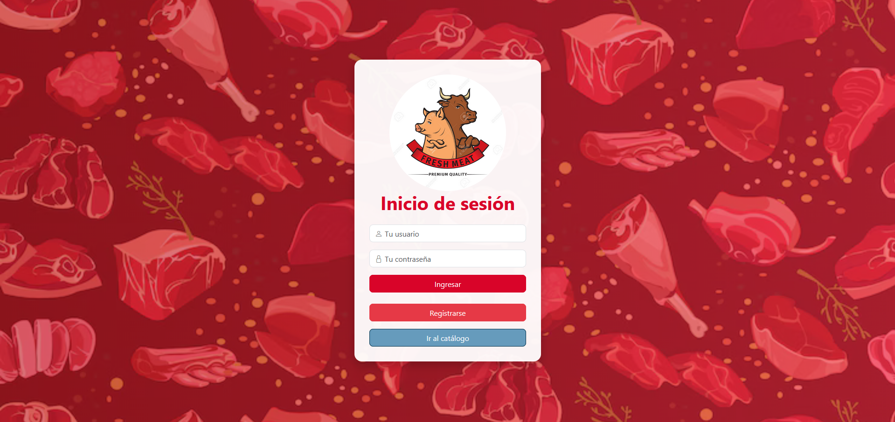
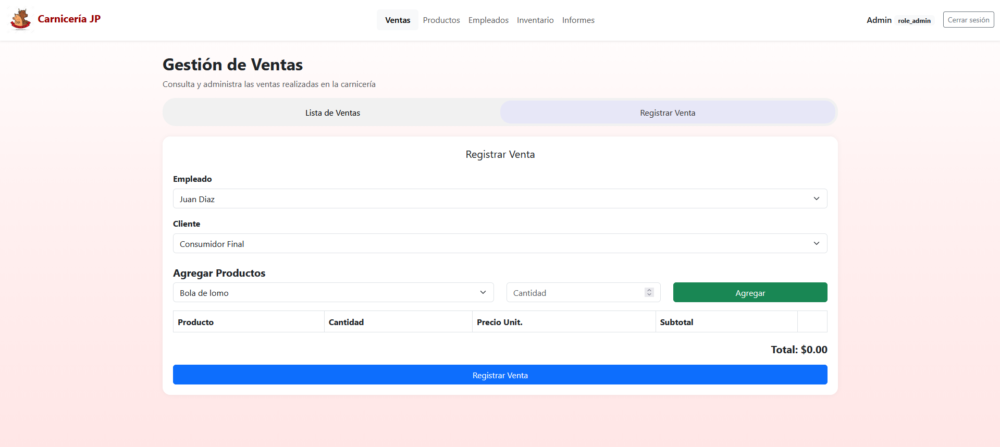
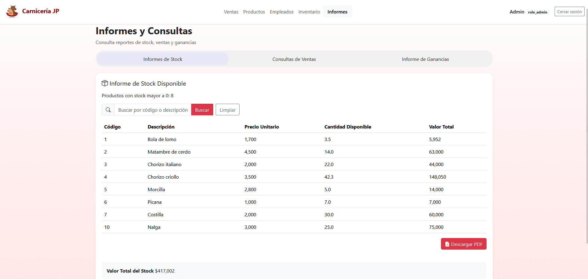
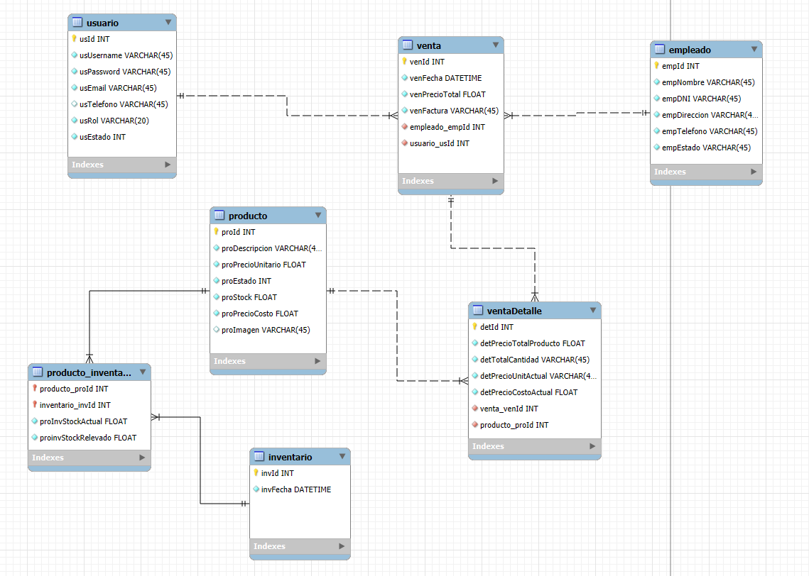

# 🥩 Butcher Shop Management System (Full Stack)


> **Status:** Completed & Functional. Ready for deployment.

## 📖 Overview

A comprehensive **Full Stack Management Solution** designed to digitize the daily operations of a retail meat business (Butcher Shop).

This system replaces manual/paper-based workflows with a centralized digital platform, allowing business owners to track stock in real-time, manage employee sales, and generate historical reports. It was built with a strong focus on **Relational Database Design** and **Business Logic integrity**.

---

## 💻 Tech Stack

* **Backend:** Java 17, Spring Boot (Web, Data JPA).
* **Frontend:** Thymeleaf (Server-Side Rendering), HTML5, CSS3, Bootstrap.
* **Database:** MySQL (Relational persistence).
* **Build Tool:** Maven.
* **Version Control:** Git.

---

## 📸 Screenshots

| Login Screen | Inventory Dashboard |
| :---: | :---: |
|  |  |

| Sales Interface | Reporting |
| :---: | :---: |
|  |  |

---

## 🚀 Key Features

### 1. Inventory & Stock Control
* **Real-time Tracking:** Automatically deducts stock (in kg/units) upon every sale.
* **Product Management:** CRUD operations for meat cuts, prices per kg, and categories.
* **Low Stock Alerts:** Visual indicators when specific products are running low.

### 2. Sales Management (Point of Sale)
* **Cart System:** Allows adding multiple products to a single transaction.
* **Dynamic Calculation:** Automatically calculates total prices based on weight and current price per kg.
* **Sales History:** Detailed log of all transactions, filtered by date or employee.

### 3. User & Security
* **Role-Based Access:** Secure login for Admins (Owners) and Employees (Sellers).
* **Employee Performance:** Tracks sales performance per employee.

---

## 🗂 Database Structure (ER Diagram)

The system relies on a robust relational database schema to ensure data consistency.

|  |

* **Entities:** `Product`, `Inventory`, `User`, `Sale`, `SaleDetail`, `Employee`.
* **Relationships:**
    * One-to-Many: `Product` ➡️ `SaleDetail`
    * One-to-Many: `User` ➡️ `Sale`
    * Many-to-Many: `Sale` ↔️ `Product` (handled via `SaleDetail` for historical price accuracy).
    * Many-to-Many: `Product` ↔️ `Inventory`

---

## ⚙️ How to Run Locally

1.  **Clone the repository:**
    ```bash
    git clone [https://github.com/lucianoZG/tu-repo-carniceria.git](https://github.com/lucianoZG/tu-repo-carniceria.git)
    ```
2.  **Configure Database:**
    * Ensure MySQL is running.
    * Create a schema named `butchershop_db`.
    * Configure environmental variables with your MYSQL credentials (url, username, password and database name).
3.  **Run the App:**
    ```bash
    mvn spring-boot:run
    ```
4.  **Access:**
    * Go to `http://localhost:8080` in your browser.

---

## 🔮 Future Improvements (Roadmap)
* [ ] **Dockerization:** Containerize the app and database for easier deployment.
* [ ] **SonarQube Integration:** Implement static code analysis for code quality.
* [ ] **Charts:** Integrate Chart.js for visual sales reporting.

---

## 📩 Contact

**Luciano Rafael Zanni Giuliano**
* **LinkedIn:** [linkedin.com/in/lucianozannig](https://www.linkedin.com/in/lucianozannig)
* **Email:** lucianozannig@gmail.com
